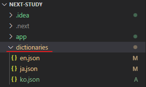
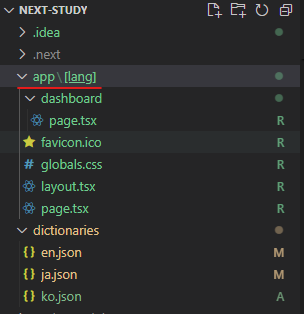
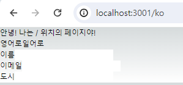
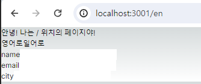
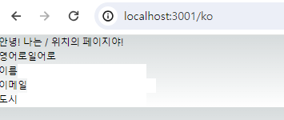

# Next.js
### i18next를 사용한 다국어 적용 + 현재 위치한 location 기반의 언어 적용
1. <code>npm i @formatjs/intl-localematcher i18next negotiator</code>
2. /i18n.js 설정
    * 위치 : /app폴더와 동일 선상
    ```js
    export const i18n = {
        defaultLocale: 'en',
        locales: ['ja', 'en', 'ko']
    }
    ```
3. dictionaries 폴더 생성 및 언어별 json 파일 생성
    * 위치 : /app폴더와 동일 선상<br/>
    
    ```json
    // ko.json
    {
        "form": {
            "name": "이름",
            "email": "이메일",
            "city": "도시"
        }
    }

    // en.json
    {
        "form": {
            "name": "name",
            "email": "email",
            "city": "city"
        }
    }
    ```
4. dictionary.js (또는 getDictionary.js ) 설정
    * 위치 : /dictionary.js와 동일 선상
    ```js
    import {i18n} from './i18n';

    const dictionaries = {
        en: () => import("./dictionaries/en.json").then(r => r.default),
        ja: () => import("./dictionaries/ja.json").then(r => r.default),
        ko: () => import("./dictionaries/ko.json").then(r => r.default),
    }

    export const getDictionary = async (locale) => dictionaries[i18n.locales.includes(locale) ? locale : i18n.defaultLocale]()
    ```
5. 언어별 동적 페이지 생성
    * 위치 : /app폴더 하단으로 진행
    * /app/[lang]폴더 생성 : 동적 페이지 분기 설정 후 이 폴더에 globals.css, layout.tsx, page.tsx 를 모두 넣어준다.<br/>
    
    * /app/[lang]/layout.tsx
        ```tsx
        import type { Metadata } from "next";
        import { Inter } from "next/font/google";
        import "./globals.css";

        const inter = Inter({ subsets: ["latin"] });

        export const metadata: Metadata = {
            title: "Create Next App",
            description: "Generated by create next app",
            };

            export default function RootLayout({
                children, params
            }: 
            Readonly<{
                children: React.ReactNode;
                params : { lang : string}
            }>) {
            console.log(params, 'params')
            return (
                <html lang={params.lang}>
                <body className={inter.className}>{children}</body>
                </html>
            );
        }

        ```
    * /app/[lang]/page.tsx 
        ```tsx
        import Link from "next/link";
        import { getDictionary } from "../../dictionary";
        import Image from "next/image";

        export default async function Home({params} : {params : {lang : string}}) {
            const lang = await getDictionary(params.lang);
            console.log(lang, 'params for home')

            return (
                <main className="">
                <h1> 안녕! 나는 / 위치의 페이지야!</h1>
                <Link href={'/en'}>영어로</Link>
                <Link href={'/ja'}>일어로</Link>

                <div>
                    <div>
                    <label>{lang.form.name}</label>
                    <input type="text"/>
                    </div>
                    <div>
                    <label>{lang.form.email}</label>
                    <input type="email"/>
                    </div>
                    <div>
                    <label>{lang.form.city}</label>
                    <input type="text"/>
                    </div>
                </div>
                </main>
            );
        }

        ```
    * 결과 
        * localhost:3000/ko 접속 시<br/>
            
        * localhost:3000/en 접속 시<br/>
            

6. /middleware.ts 설정 : **/app 폴더와 같은 depth 선상에 있어야 함**
    * 메인 페이지 진입 시 자동으로 해당 국가의 언어를 파악하여 해당 언어 url로 redirect
    ```ts
    import { NextResponse } from "next/server";
    import type { NextRequest } from "next/server";

    import { i18n } from "./i18n";

    import { match as matchLocale } from "@formatjs/intl-localematcher";
    import Negotiator from 'negotiator';

    function getLocale(request: NextRequest): string | undefined {
        // Negotiator expects plain object so we need to transform headers
        const negotiatorHeaders: Record<string, string> = {};
        request.headers.forEach((value, key) => (negotiatorHeaders[key] = value));

        // @ts-ignore locales are readonly
        const locales: string[] = i18n.locales;

        // Use negotiator and intl-localematcher to get best locale
        let languages = new Negotiator({ headers: negotiatorHeaders }).languages(
            // locales,
        );
        console.log(languages);

        const locale = matchLocale(languages, locales, i18n.defaultLocale);

            console.log("나의 locale: " + locale);

        return locale;
    }

    export function middleware(request: NextRequest) {
        const pathname = request.nextUrl.pathname;

        console.log(pathname+"!!!");

        // Check if there is any supported locale in the pathname
        const pathnameIsMissingLocale = i18n.locales.every(
            (locale) =>
            !pathname.startsWith(`/${locale}/`) && pathname !== `/${locale}`,
        );

        // Redirect if there is no locale
        if (pathnameIsMissingLocale) {
            const locale = getLocale(request);

            // e.g. incoming request is /products
            // The new URL is now /en-US/products
            return NextResponse.redirect(
                new URL(
                    `/${locale}${pathname.startsWith("/") ? "" : "/"}${pathname}`,
                    request.url,
                ),
            );
        }
    }

    export const config = {
        // Matcher ignoring `/_next/` and `/api/`
        matcher: ["/((?!api|_next/static|_next/image|favicon.ico).*)"],
    };
    ```


    * 결과 (/localhost:3000/ 으로 진입 시 자동으로 /localhost:3000/ko로 보내진다.)<br/>
        

    * console
        ```console
        /!!!
        [ 'ko-KR', 'ko', 'en-US', 'en' ]
        나의 locale: ko
        /ko!!!
        { lang: 'ko' } params
        { form: { name: '이름', email: '이메일', city: '도시' } } params for home
        { lang: 'favicon.ico' } params
        { form: { name: 'name', email: 'email', city: 'city' } } params for home
        ```

* 출처 및 참조 
    * getDictionary.js : https://github.com/vercel/next.js/issues/46918
    * middleware.ts : https://github.com/vercel/next.js/blob/canary/examples/app-dir-i18n-routing/middleware.ts
    * 전체적인 소스 : https://atulfind.medium.com/next-13-4-localization-internationalization-using-app-router-8b001fdf572e
    * https://velog.io/@furium/i18n-in-next.js-app-directory